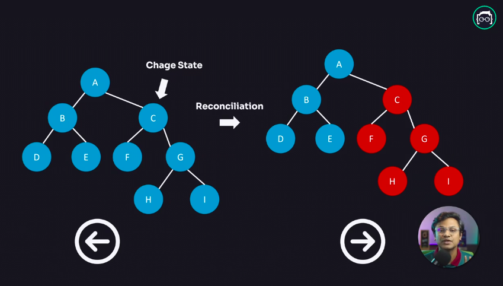

## <h1 className="bg-gradient-to-r from-blue-500 to-purple-500 inline-block text-transparent bg-clip-text text-5xl">DOM কি আসলেই স্লো?</h1>

নাহ, ডম কখনোই স্লো নয়। ডম বা Document Object Model আসলে ব্রাউজারের একটি কার্যকরী উপাদান, যা ওয়েব পেজের HTML এবং XML ডেটাকে কাঠামোবদ্ধ করে। যদি কোডটি সঠিকভাবে লেখা হয় এবং যথাযথভাবে অপটিমাইজ করা হয়, তবে ডম কার্যকরভাবে কাজ করতে পারে। তবে, বর্তমান যুগের ওয়েব অ্যাপ্লিকেশনগুলো অত্যন্ত ইন্টারেক্টিভ হয়ে উঠছে, যা ইউজারের ইন্টারেকশনের ফলে ব্রাউজারকে বারবার রি-পেইন্ট করতে বাধ্য করে।

### ডম স্লো হবার কারণ

ডম স্লো হবার প্রধান কারণগুলো হলো ম্যানুয়াল ডম ম্যানিপুলেশন, রিপেইন্টিং প্রক্রিয়া এবং জটিল UI। প্রথমত, ম্যানুয়াল ডম ম্যানিপুলেশন একটি গুরুত্বপূর্ণ ফ্যাক্টর। যখনই ইউজার কোনো ইন্টারঅ্যাকশনে অংশগ্রহণ করে, যেমন একটি বাটনে ক্লিক করা বা ফর্মে ডেটা প্রবেশ করা, তখন ডম পরিবর্তন করার জন্য অনেক কোড লিখতে হয়। এই অবস্থায়, একাধিক ডম অপারেশন একসাথে করা হলে তা সাধারণত পারফরম্যান্সকে প্রভাবিত করে। প্রতিটি পরিবর্তনের জন্য ব্রাউজারকে পুনরায় রি-পেইন্ট করতে হয়, যা পারফরম্যান্সে ব্যাঘাত ঘটায়।

দ্বিতীয়ত, রিপেইন্টিং প্রক্রিয়া। যখন ডমে কোনো পরিবর্তন ঘটে, তখন ব্রাউজারকে সম্পূর্ণ পেইন্টিং প্রক্রিয়া পুনরায় শুরু করতে হতে পারে। অর্থাৎ, যদি কোনো পরিবর্তন ঘটে, তাহলে পুরো পেইন্টিং প্রক্রিয়া আবার শুরু হয়। এই প্রক্রিয়াটি সময়সাপেক্ষ এবং সিস্টেমের কার্যকারিতা কমাতে পারে।

তৃতীয়ত, বর্তমান সময়ের অ্যাপ্লিকেশনগুলো সাধারণত বহু স্তরের এবং জটিল UI নিয়ে কাজ করে। এই ধরনের UI-তে প্রতিটি উপাদান পরিবর্তনের জন্য বিভিন্ন স্তরের মধ্যে রি-পেইন্ট করতে হয়। এর ফলে সব উপাদানের রি-পেইন্ট প্রক্রিয়া লম্বা হয়ে যায়, যা ব্যবহারকারীর অভিজ্ঞতাকে প্রভাবিত করে।

এই কারণগুলো মিলিয়ে ডমের পারফরম্যান্সকে স্লো করে দিতে পারে, এবং এর সমাধানে সঠিক কৌশল প্রয়োগ করা অপরিহার্য।

### ব্রাউজার কিভাবে DOM রেন্ডার করে?

আমরা দেখতে পাচ্ছি যে, ব্রাউজার কিভাবে কাজ করে এবং কীভাবে এটি একটি ওয়েব পেজ রেন্ডার করে।

প্রথমে, যখন ব্রাউজার একটি নতুন `HTML` এবং `CSS` ফাইল পায়, তখন এটি সেই ফাইলগুলোকে পার্স করে। এটি মূলত একটি বোঝার প্রক্রিয়া, যেখানে ব্রাউজার `HTML` এর জন্য `HTML PARSER` এবং `CSS` এর জন্য `CSS PARSER` ব্যবহার করে। এই সময়ে, ব্রাউজার ফাইলের মধ্যে থাকা ট্যাগ, বৈশিষ্ট্য এবং বিষয়বস্তু বুঝতে পারে এবং সেগুলোকে একটি কাঠামোবদ্ধ ফর্মে রূপান্তর করে।

এরপর, ব্রাউজার `HTML` থেকে একটি `DOM TREE` তৈরি করে। এটি একটি গাছের মতো কাঠামো, যেখানে প্রতিটি `HTML` উপাদান একটি নোড হিসেবে থাকে। এটা আমাদের বলে দেয়, আমাদের পৃষ্ঠার কাঠামো কেমন হবে এবং কোন উপাদানগুলি একে অপরের সাথে কিভাবে সম্পর্কিত।

এখন ব্রাউজার `CSS` থেকে `CSSOM` (CSS Object Model) তৈরি করে। এই ধাপে, সমস্ত স্টাইল নিয়ম ধারণ করা হয়, যেন ব্রাউজার জানে প্রতিটি উপাদানের জন্য কি ধরনের স্টাইল প্রয়োগ করতে হবে।

যখন `DOM TREE` এবং `CSSOM` একত্রিত হয়, তখন একটি `RENDER TREE` তৈরি হয়। এই গাছটি নির্দেশ করে, কোন UI উপাদানগুলি ব্যবহারকারীর জন্য দৃশ্যমান হবে। অর্থাৎ, আমরা যা দেখতে পাবো।

পরবর্তী ধাপে, ব্রাউজার `LAYOUT` ফেসে প্রবেশ করে, যেখানে এটি নির্ধারণ করে প্রতিটি উপাদান কোথায় থাকবে এবং কতটুকু জায়গা নেবে। এই সময়ে, ব্রাউজার জানে কোন উপাদানটি কোথায় পজিশন হবে এবং এর আকার কেমন হবে।

সবশেষে, ব্রাউজার সমস্ত তথ্যের ভিত্তিতে UI কে পেইন্ট করে, এবং আমরা ফাইনাল আউটপুট দেখতে পাই। এই সময়ে, সবকিছু একসাথে করে একটি ছবির মতো রেন্ডার করা হয়, যা আমাদের স্ক্রিনে দেখানো হয়।

এভাবে ব্রাউজার আমাদের দেখতে পাওয়া ওয়েব পেজ তৈরি করে, এবং এই পুরো প্রক্রিয়া আমাদের জন্য কাজ করে!

### সমস্যা সমাধানের উপায়

ব্রাউজারের রি-পেইন্টিং প্রসেস অ্যাপ্লিকেশনকে স্লো করে দিতে পারে। এই সমস্যা এড়ানোর জন্য আমরা দুইটি উপায়ে সমাধান করতে পারি:

1. **ব্যাচ আপডেট:**

   - একাধিক পরিবর্তন একসাথে করা, যা একযোগে একবারে প্রয়োগ করা যায়। এটি বিশেষভাবে উপকারী যখন একাধিক UI পরিবর্তন একটি একক ইন্টারঅ্যাকশনের ফলস্বরূপ ঘটে।
   - উদাহরণস্বরূপ, একটি ফর্ম জমা দেওয়ার সময় একাধিক ইনপুট ফিল্ডের মান একযোগে পরিবর্তিত হলে, সবগুলো পরিবর্তন একসাথে করা যেতে পারে।

2. **ডম ম্যানিপুলেশন কম করা:**
   - যতটা সম্ভব কম ডম ম্যানিপুলেশন করা, যাতে রেন্ডারিংয়ের সময় কম হয়।
   - রিয়াক্ট ভার্চুয়াল ডম ব্যবহার করে, যা মূল ডমে খুব কম পরিবর্তন করে।

---

# ভার্চুয়াল ডম কি? কিভাবে ভার্চুয়াল ডম কাজ করে?

---

## ভার্চুয়াল ডম কি?

ভার্চুয়াল ডম হলো রিয়াক্টের একটি গুরুত্বপূর্ণ প্রযুক্তি, যা ওয়েব অ্যাপ্লিকেশনগুলোর পারফরম্যান্স উন্নত করতে ব্যবহৃত হয়। এটি মূলত একটি পারফরম্যান্স অপটিমাইজেশন কৌশল হিসেবে কাজ করে, যা মূল ডম ম্যানিপুলেশনকে কমিয়ে আনে। 

রিয়াক্ট যখন কোনো ইউজার ইন্টারঅ্যাকশন ঘটায়, তখন এটি সরাসরি মূল ডমকে পরিবর্তন না করে। এর পরিবর্তে, রিয়াক্ট একটি ভার্চুয়াল ডম তৈরি করে, যা মূল ডমের একটি কপি। এই ভার্চুয়াল ডমে সমস্ত পরিবর্তন করা হয়। 

একবার পরিবর্তনগুলো হয়ে গেলে, রিয়াক্ট একটি এলগরিদম ব্যবহার করে নতুন ভার্চুয়াল ডম এবং পুরানো ভার্চুয়াল ডমের মধ্যে তুলনা করে। এটি পরিবর্তনগুলোর সঠিক স্থান চিহ্নিত করে এবং শুধুমাত্র সেই অংশগুলোকে মূল ডমে আপডেট করে। 

এই প্রক্রিয়ার মাধ্যমে, রিয়াক্ট পুরো অ্যাপ্লিকেশনটি পুনরায় রি-রেন্ডার না করে, বরং শুধুমাত্র সেই অংশগুলোকে আপডেট করে, যা কার্যকারিতা এবং দ্রুততাকে বৃদ্ধি করে। ফলে ব্যবহারকারীরা একটি দ্রুত এবং আরো প্রতিক্রিয়া প্রদানকারী UI অভিজ্ঞতা পায়।

### ভার্চুয়াল ডম এর কার্যপ্রণালী

রিয়াক্ট ভার্চুয়াল ডমের মাধ্যমে ডম ম্যানিপুলেশনকে সর্বনিম্নে রাখে। যখন ইউজার কোনো ইন্টারঅ্যাকশন করে এবং `UI` তে পরিবর্তন করতে হয়, তখন রিয়াক্ট সরাসরি `HTML` এর `DOM TREE` পরিবর্তন করে না। পরিবর্তনের সময়, রিয়াক্ট ভার্চুয়াল `DOM` এর মাধ্যমে `UI` এর একটি রেপ্লিকা তৈরি করে।

1. **ডম কপি করা:**

   - রিয়াক্ট ভার্চুয়াল ডম ব্যবহার করে, মূল `DOM` থেকে একটি কপি তৈরি করে।
   - এই কপি মূল DOM এর সাথে সমান্তরালে কাজ করে এবং এতে পরিবর্তন ঘটানো হয়।

2. **Diffing এলগরিদম:**

   - এরপর, রিয়াক্ট তার নিজস্ব এলগরিদম `Diffing` বা `Reconciliation` এর মাধ্যমে নিরীক্ষণ করে দেখে UI এর ঠিক কোন অংশে পরিবর্তন হয়েছে।
   - এলগরিদমটি নতুন ভার্চুয়াল ডম এবং পুরানো ভার্চুয়াল ডমের মধ্যে তুলনা করে, পরিবর্তনগুলি চিহ্নিত করে।

3. **মিনিমাম রি-রেন্ডার:**

   - এই প্রক্রিয়ার মাধ্যমে, পুরো অ্যাপ্লিকেশনটি পুনরায় রি-রেন্ডার না করে শুধুমাত্র পরিবর্তিত অংশটুকু `DOM` এ আপডেট করে দেয়।
   - এটি সময় সাশ্রয়ী এবং ব্রাউজারের কর্মক্ষমতা বাড়ায়।

4. **পারফরম্যান্স উন্নতি:**
   - ভার্চুয়াল ডম প্রযুক্তি ব্যবহার করে রিয়াক্ট মিনিমাম ডম অপারেশন করে এবং এপ্লিকেশনের পারফরম্যান্স উন্নত করে।
   - এর ফলে ব্যবহারকারীরা দ্রুত এবং প্রতিক্রিয়া প্রদানকারী UI অভিজ্ঞতা পান।

### উপসংহার

ডম কখনোই স্লো নয়, বরং ব্রাউজারের রেন্ডারিং প্রক্রিয়া এবং কোডের কার্যকারিতা তার পারফরম্যান্সে প্রভাব ফেলে। ডম ম্যানিপুলেশন সর্বনিম্নে রাখার মাধ্যমে এবং ভার্চুয়াল ডমের ব্যবহারে, রিয়াক্ট একটি দ্রুত ও কার্যকরী ব্যবহারকারীর অভিজ্ঞতা নিশ্চিত করে। এই প্রযুক্তি অ্যাপ্লিকেশনগুলোর পারফরম্যান্সে এক বড় ভূমিকা পালন করে, যা আধুনিক ওয়েব ডেভেলপমেন্টের জন্য অপরিহার্য।

---
