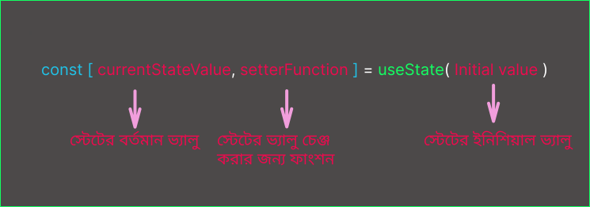

## <h1 className="bg-gradient-to-r from-blue-500 to-purple-500 inline-block text-transparent bg-clip-text text-3xl pt-2">React এ স্টেট কেন প্রয়োজন?</h1>

তুমি যখন একটি ইন্টারেক্টিভ অ্যাপ্লিকেশন তৈরি করো, তখন এপ্লিকেশনের বিভিন্ন অংশে বিভিন্ন অবস্থার পরিবর্তন প্রয়োজন হয়। এই পরিবর্তিত অবস্থাগুলোকে ট্র্যাক করার জন্যই স্টেটের প্রয়োজন হয়। যেমন, তুমি যদি একটি বাটনে ক্লিক করার পর একটি মডাল ওপেন করতে চাও, তখন সেই মডালের ওপেন বা ক্লোজ অবস্থা দুটি ভিন্ন স্টেট। এই স্টেট পরিবর্তনের মাধ্যমে React বুঝতে পারে, UI-তে কোন পরিবর্তন আনতে হবে।

### স্টেট (State) কী?

`State` মানে অবস্থা। React কম্পোনেন্টের মধ্যে বিভিন্ন অবস্থাকে বোঝাতেই স্টেট ব্যবহৃত হয়। ধরো, তুমি একটি বাটনে ক্লিক করেছো এবং একটি মডাল ওপেন হয়েছে, তখন মডালের ওপেন অবস্থা একধরনের স্টেট। আবার, মডাল ক্লোজ থাকা অবস্থাটাও একটি ভিন্ন স্টেট।

React ডেভেলপ করার মূল কারণ হলো, এপ্লিকেশন যখন ইন্টারেকটিভ হয়, তখন যেন UI স্বয়ংক্রিয়ভাবে আপডেট হয়। আর সেটা সম্ভব হয়, যখন React বিভিন্ন স্টেট ম্যানেজ করে এবং সেগুলো পরিবর্তিত হলে UI রি-রেন্ডার করে।

---

## কেন আমরা রেগুলার ভ্যারিয়েবল দিয়ে স্টেট ম্যানেজ করতে পারি না?

সাধারণ ভ্যারিয়েবল দিয়ে কাজ করলে সমস্যা হলো, React বুঝতে পারে না কবে কম্পোনেন্টের মধ্যে কিছু পরিবর্তন ঘটেছে। ফলে React সেই পরিবর্তন অনুযায়ী UI আপডেট করতে পারে না।

### লোকাল ভ্যারিয়েবলের সীমাবদ্ধতাঃ

1. **Local variables don't persist between renders:** React যখন একটি কম্পোনেন্ট রি-রেন্ডার করে, তখন আগের রেন্ডারের লোকাল ভ্যারিয়েবলগুলোকে আর মনে রাখে না। তাই স্টেট পরিবর্তনের সময় রেন্ডারের পর সেই পরিবর্তনগুলো হারিয়ে যায়।

2. **Changes to local variables won't trigger renders:** লোকাল ভ্যারিয়েবল চেঞ্জ হলে React নিজে থেকে রেন্ডার ট্রিগার করে না। মানে, UI তে সেই পরিবর্তন দেখানো হয় না।

---

## স্টেট ব্যবহারের দুটি প্রধান কারণ

React-এ UI আপডেটের জন্য দুইটি বিষয় জরুরি:

1. **Retain the data between renders:** রি-রেন্ডারের পর আগের ডাটাকে মনে রাখা জরুরি, যেন নতুন স্টেটের উপর ভিত্তি করে UI আপডেট করা যায়।

2. **Trigger a Re-render:** স্টেট চেঞ্জ হলে React নিজে থেকে রি-রেন্ডার ট্রিগার করে, যাতে UI আপডেট হয়।

---

## `useState` হুক কিভাবে এই কাজগুলো করে?

React-এর `useState` হুক দুটি গুরুত্বপূর্ণ ফাংশনালিটি সরবরাহ করে:

1. **A State Variable:** এটি এমন একটি ভ্যারিয়েবল দেয় যা প্রতিবার রি-রেন্ডারের পরেও তার মান ধরে রাখে।
2. **A Setter Function:** এর মাধ্যমে আমরা স্টেট পরিবর্তন করতে পারি। যখন এই ফাংশনের মাধ্যমে স্টেট আপডেট করা হয়, তখন React আবার রি-রেন্ডার করে UI-তে পরিবর্তন আনে।

---

## `useState` হুক-এর সিনট্যাক্স ও ব্যবহার

### `useState` হুকের ভিত্তিমূলক গঠন

```jsx
const [currentValue, setterFunction] = useState(initialValue);
```

যেখানে:

- **currentValue** হলো বর্তমান স্টেটের মান।
- **setterFunction** হলো একটি ফাংশন, যার মাধ্যমে স্টেট আপডেট করা যায়।
- **initialValue** হলো স্টেটের প্রাথমিক মান।

### উদাহরণ

```jsx
import { useState } from "react";

export default function App() {
  const [count, setCount] = useState(0);

  return (
    <>
      <h1>Count: {count}</h1>
      <button onClick={() => setCount(count + 1)}>
        Click to Increment Count
      </button>
    </>
  );
}
```

---

## রেন্ডার এবং রি-রেন্ডারিং প্রসেস

React-এর স্টেট কিভাবে কাজ করে, তা বোঝার জন্য নিচের ধাপগুলো দেখা যাক:

1. **প্রথমবার রেন্ডার হলে:** প্রথমবার যখন কম্পোনেন্ট রেন্ডার হয়, তখন স্টেটের ইনিশিয়াল ভ্যালু ব্যবহার করা হয়। ধরো, `useState(0)` দেওয়া হয়েছে, তখন `count` এর মান হবে ০।

2. **স্টেট আপডেট হলে:** যখন `setCount(count + 1)` ব্যবহার করে স্টেট পরিবর্তন করা হয়, তখন নতুন মান ১ হয়ে যায় এবং React নতুন রেন্ডারিং ট্রিগার করে।

3. **পরবর্তী রেন্ডারিং:** পরবর্তী রেন্ডারিং এ React আগের স্টেট মনে রাখে এবং নতুন স্টেটের মান দিয়ে কম্পোনেন্ট আপডেট করে।



---

## মাল্টিপল স্টেট ম্যানেজ করা

একটি কম্পোনেন্টে যদি একাধিক স্টেট ম্যানেজ করতে হয়, তাহলে আমরা একাধিক `useState` ব্যবহার করতে পারি। উদাহরণস্বরূপ:

```jsx
import { useState } from "react";

export default function App() {
  const [count, setCount] = useState(0);
  const [name, setName] = useState("React");

  return (
    <>
      <h1>
        {name}: {count}
      </h1>
      <button onClick={() => setCount(count + 1)}>Increment Count</button>
      <input
        type="text"
        value={name}
        onChange={(e) => setName(e.target.value)}
      />
    </>
  );
}
```

---

## স্টেট হলো কম্পোনেন্টের প্রাইভেট ডাটা

React এর স্টেট কম্পোনেন্টের অভ্যন্তরে আইসোলেটেড থাকে। প্রতিটি কম্পোনেন্টের স্টেট অন্য কম্পোনেন্টের থেকে আলাদা। একই কম্পোনেন্ট বারবার ব্যবহার করা হলেও প্রতিটির স্টেট স্বতন্ত্র হবে।

তবে, যদি একাধিক কম্পোনেন্টের স্টেট `sync` করতে হয়, তখন `lifting state up` টেকনিক ব্যবহার করা হয়। এতে স্টেটকে প্যারেন্ট কম্পোনেন্টে রাখা হয় এবং প্যারেন্ট থেকে চাইল্ড কম্পোনেন্টে প্রপস আকারে পাস করা হয়।

---

### সংক্ষেপে, `useState` হুকের মাধ্যমে React এ ডায়নামিক ও ইন্টারেকটিভ UI তৈরি করা সহজ হয়, কারণ স্টেটের পরিবর্তনে React স্বয়ংক্রিয়ভাবে রেন্ডার এবং আপডেট করে।
