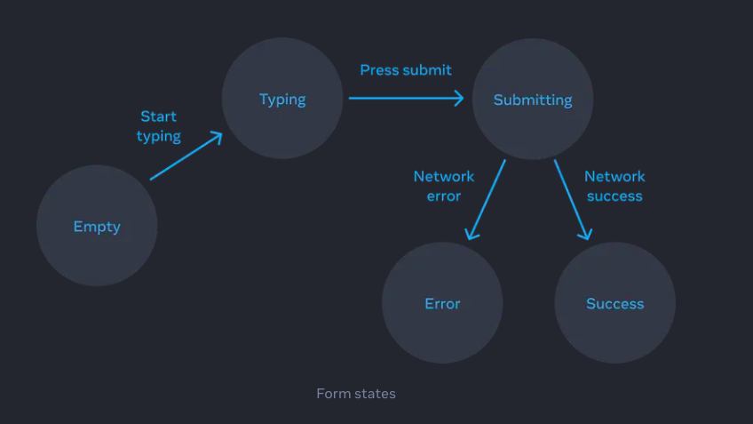

import { Step, Steps } from "fumadocs-ui/components/steps";

## <h1 className="bg-gradient-to-r from-blue-500 to-purple-500 inline-block text-transparent bg-clip-text text-xl pt-2"> ইউ আই-কে ডিক্লারেটিভলি ভাবা (Thinking about UI Declaratively)</h1>

React এ তুমি যখন UI ম্যানেজ করবে, স্টেট ব্যবহার করেই করতে হবে। কারণ, UI কীভাবে আপডেট হবে, তা স্টেটের উপর নির্ভর করে। কিন্তু, তুমি কীভাবে স্টেট ম্যানেজ করবে, সেটাও গুরুত্বপূর্ণ। এজন্য কয়েকটি ধাপ খুব ভালোভাবে বুঝতে হবে। এই ধাপগুলো ঠিকমতো ফলো করলে, বড় বড় UI-র স্টেটও সহজেই ম্যানেজ করতে পারবে। চলো, ধাপগুলো বিস্তারিত জানি:

1. **কম্পোনেন্টের বিভিন্ন ভিজুয়াল স্টেট নির্ধারণ করা**
2. **কী কী ইভেন্টে স্টেট পরিবর্তন হবে তা নির্ধারণ করা**
3. **`useState` দিয়ে স্টেটকে মেমরিতে রিপ্রেজেন্ট করা**
4. **অপ্রয়োজনীয় স্টেট বাদ দেওয়া**
5. **ইভেন্ট হ্যান্ডলারগুলোকে স্টেট পরিবর্তনের সাথে সংযোগ করা**

<Steps>
<Step>

### কম্পোনেন্টের বিভিন্ন ভিজুয়াল স্টেট নির্ধারণ করা (Identify Component's Different Visual States)

প্রথম ধাপ হলো, আমাদের বুঝতে হবে যে UI তে কী কী পরিবর্তন হতে পারে। মানে, UI কেমন দেখতে পারে তা ভিজুয়ালাইজ করা। তুমি কি কখনো এমন কিছু ভাবছো যেখানে তুমি কিছু টেক্সট টাইপ করছো, আর তোমার টাইপিং শেষ হলে সাবমিট বাটন ক্লিক করলে লোডিং দেখাবে? যদি সঠিক উত্তর দাও, সাকসেস দেখাবে, আর যদি ভুল হয়, তাহলে ইরর দেখাবে।

উদাহরণ হিসেবে, ধরো তুমি একটি ফর্ম তৈরি করছো যেটা একটি প্রশ্নের উত্তর নেয়। তখন এই ফর্মের কি কি স্টেট হতে পারে? ধরো, নিচের মত পাঁচটি স্টেট হতে পারে:

১। ফর্মে কিছু না লিখলে সেটা হবে `empty`।
২। কিছু লিখতে শুরু করলে সেটা হবে `typing`।
৩। সাবমিট করলে হবে `submitting`।
৪। সঠিক উত্তর দিলে দেখাবে `success`।
৫। ভুল উত্তর দিলে দেখাবে `error`।

এই স্টেটগুলো তোমার UI তে কী কী পরিবর্তন আসতে পারে তা বুঝিয়ে দেয়। এক্ষেত্রে, আমরা স্টেটগুলোকে ভিজুয়ালাইজ করতে পারি। যেমন ধরো:

- `Empty`: ফর্ম ফাঁকা, কিছু লেখা হয়নি।
- `Typing`: ইউজার কিছু লিখছে।
- `Submitting`: ফর্ম সাবমিট করা হচ্ছে।
- `Success`: সঠিক উত্তর দেওয়া হয়েছে।
- `Error`: ভুল উত্তর দেওয়া হয়েছে।

এখন, তুমি দেখতেই পাচ্ছো, পাঁচটি ভিজুয়াল স্টেট রয়েছে যেগুলো নিয়ে আমাদের কাজ করতে হবে। এইভাবে প্রতিটি ভিজুয়াল স্টেট চিন্তা করা একটা ভালো অভ্যাস, যেটা আমরা স্টোরিবুকের মাধ্যমে সহজে করতে পারি। স্টেটগুলো ভিজুয়ালি দেখতে এমন হতে পারে:

১। 
২। 
৩। 
৪। 
৫। 

</Step>

---

<Step>

### কী কী ইভেন্টে স্টেট পরিবর্তন হবে তা নির্ধারণ করা (Determine What Triggers State Changes)

দ্বিতীয় ধাপে আমাদের বুঝতে হবে, ঠিক কোন ইভেন্টগুলো স্টেট পরিবর্তন করবে। যেমন ধরো, ইউজার যখন ইনপুট ফিল্ডে কিছু লিখছে, তখন `typing` স্টেট চালু হবে। সাবমিট বাটনে ক্লিক করলে `submitting` স্টেট চালু হবে।

এছাড়া, ইরর বা সাকসেস স্টেটগুলো নির্ভর করবে ফর্ম ভ্যালিডেশনের ওপর, অর্থাৎ কম্পিউটার তখন স্বয়ংক্রিয়ভাবে ঠিক করবে।

এই স্টেট পরিবর্তনের ফ্লো যদি আমরা একটা ডায়াগ্রামের মাধ্যমে বুঝিয়ে দিতে পারি, তাহলে পুরো প্রসেসটা আরও পরিষ্কার হয়ে যাবে। ধরো, একটা ডায়াগ্রাম এমন হতে পারে:



</Step>
<Step>

### `useState` দিয়ে স্টেটগুলোকে মেমরিতে রিপ্রেজেন্ট করা (Represent the State in Memory using `useState`)

তৃতীয় ধাপে আমরা যেসব স্টেট প্রয়োজন, সেগুলো `useState` দিয়ে ডিফাইন করবো। যেমন, ধরো আমাদের দরকার পাঁচটা স্টেট:

```jsx
const [isEmpty, setIsEmpty] = useState(true);
const [isTyping, setIsTyping] = useState(false);
const [isSubmitting, setIsSubmitting] = useState(false);
const [isSuccess, setIsSuccess] = useState(false);
const [isError, setIsError] = useState(false);
```

এছাড়াও, ইউজার কী লিখছে সেটাও আমাদের ট্র্যাক করতে হবে। এজন্য আমরা ইনপুটের জন্য আরও একটি স্টেট নিবো:

```jsx
const [answer, setAnswer] = useState("");
const [error, setError] = useState(null);
```

</Step>

<Step>

### অপ্রয়োজনীয় স্টেট বাদ দেওয়া (Remove Non-Essential State Variables)

এখন, চতুর্থ ধাপে আমাদের দেখতে হবে, সব স্টেটই কি দরকার? যেমন ধরো, `empty` আর `typing` স্টেট আমরা শুধুমাত্র `answer` স্টেট দিয়েই ম্যানেজ করতে পারি। যদি `answer.length === 0`, তাহলে এটা `empty` স্টেট। আর `answer.length > 0` হলে এটা `typing` স্টেট।

এছাড়া, `submitting`, `success`, এবং `error` স্টেটগুলো আমরা একটা সাধারণ `status` স্টেট দিয়েই করতে পারি। ধরো, আমরা `status` স্টেট হিসেবে নিচ্ছি:

```jsx
const [status, setStatus] = useState("typing"); // 'submitting', 'success', or 'error'
```

তাহলে আমরা এখন তিনটি স্টেট দিয়ে সবকিছু ম্যানেজ করতে পারছি:

```jsx
const [answer, setAnswer] = useState("");
const [error, setError] = useState(null);
const [status, setStatus] = useState("typing"); // 'submitting', 'success', or 'error'
```

</Step>

<Step>
###  ইভেন্ট হ্যান্ডলারগুলোকে স্টেট পরিবর্তনের সাথে সংযোগ করা (Connect Event Handlers to Set State)

এবার আমাদের শেষ কাজ হলো, ইভেন্ট হ্যান্ডলারগুলোর সাথে স্টেটের সেটার ফাংশনগুলো কানেক্ট করা। ধরো, ইউজার যখন টাইপ করছে, তখন `setAnswer` এবং `setStatus` আপডেট করতে হবে। আর সাবমিট করার সময় `setStatus` হবে `submitting`।

তুমি যদি একটি `onChange` হ্যান্ডলার লিখতে চাও, তাহলে এমন হবে:

```jsx
const handleChange = (e) => {
  setAnswer(e.target.value);
  setStatus("typing");
};
```

আর সাবমিট বাটনের জন্য:

```jsx
const handleSubmit = () => {
  setStatus("submitting");
  // Validation logic...
  if (answer === "correct") {
    setStatus("success");
  } else {
    setError("Wrong answer!");
    setStatus("error");
  }
};
```

</Step>
</Steps>
---

এইভাবে, আমরা স্টেট ম্যানেজমেন্টের পুরো প্রসেসটা খুব সুন্দর করে ম্যানেজ করতে পারি। এখানে আমরা স্টেপ-বাই-স্টেপ গিয়ে বুঝেছি, কিভাবে তুমি তোমার UI-কে ডিক্লারেটিভ পদ্ধতিতে ম্যানেজ করতে পারো।
