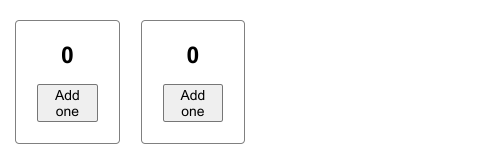
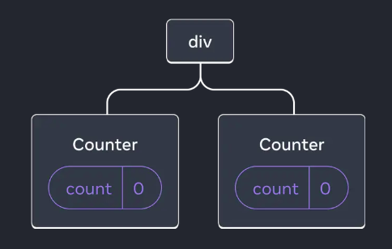

## <h1 className="bg-gradient-to-r from-blue-500 to-purple-500 inline-block text-transparent bg-clip-text text-4xl pt-2">Preserving and Resetting State</h1>

React-এর state প্রতিটি কম্পোনেন্টের ভেতরই আলাদা এবং নির্দিষ্ট থাকে। যখনই React তার কম্পোনেন্টগুলো রেন্ডার করে, সে তাদের একসাথে একটা রেন্ডার ট্রিতে (render tree) স্টোর করে রাখে। আর এই ট্রির মাধ্যমে সে বুঝতে পারে যে কোন কম্পোনেন্ট কোথায় আছে, এবং কখন তার স্টেট ঠিক রাখতে হবে বা কখন স্টেট রিসেট করতে হবে।

এখন React কীভাবে state ধরে রাখে বা কখন state রিসেট করে, সেটা নিয়ে একটু ভালোভাবে বুঝে নিই। আর এজন্য আমাদের React এর তিনটি বিশেষ রুলস মনে রাখতে হবে:

**React তিনটি নিয়ম মেনে চলে:**

👉 **1. State is tied to a position in the render tree (রেন্ডার ট্রির পজিশনের সাথে স্টেট জড়িত থাকে)**

👉 **2. Same component at the same position preserves state (একই পজিশনে একই কম্পোনেন্ট থাকলে স্টেট ধরে রাখে)**

👉 **3. Different components at the same position reset state (একই পজিশনে আলাদা কম্পোনেন্ট এলে স্টেট রিসেট হয়ে যায়)**

### 1. State is tied to a position in the render tree

React প্রতিটি কম্পোনেন্টকে একটি গাছের (tree) মতো ভাবে, যেখানে প্রতিটি ডাল বা পাতা হলো একেকটি কম্পোনেন্ট। আর প্রতিটি ডালের অবস্থানের সাথে কম্পোনেন্টের state-ও সম্পর্কিত থাকে। অর্থাৎ, একই কম্পোনেন্ট যদি বিভিন্ন অবস্থানে থাকে, সেগুলোর state আলাদা হবে। একটিতে স্টেট পরিবর্তন করলেও অন্যটির স্টেটে কোনো প্রভাব পড়বে না।

```jsx
import { useState } from "react";

export default function App() {
  const counter = <Counter />;
  return (
    <div>
      {counter}
      {counter}
    </div>
  );
}

function Counter() {
  const [score, setScore] = useState(0);
  const [hover, setHover] = useState(false);

  let className = "counter";
  if (hover) {
    className += " hover";
  }

  return (
    <div
      className={className}
      onPointerEnter={() => setHover(true)}
      onPointerLeave={() => setHover(false)}
    >
      <h1>{score}</h1>
      <button onClick={() => setScore(score + 1)}>Add one</button>
    </div>
  );
}
```

এখানে একই `Counter` কম্পোনেন্টকে দুইবার ব্যবহার করা হয়েছে:

```jsx
export default function App() {
  const counter = <Counter />;
  return (
    <div>
      {counter}
      {counter}
    </div>
  );
}
```

তুমি UI-তে দেখবে, দুইটি কাউন্টার একসাথে রেন্ডার হয়েছে, মানে পাশাপাশি বসেছে। কিন্তু প্রত্যেকটি আলাদা অবস্থানে আছে বলে তাদের state-ও আলাদা আলাদা থাকবে। একটাতে স্টেট পরিবর্তন করলে অন্যটির স্টেটে কোনো পরিবর্তন হবে না। নিচের ছবিটা একটু দেখো:



যদিও দুটি একই কম্পোনেন্ট, তারা কিন্তু React-এর ট্রিতে আলাদা আলাদা জায়গায় আছে, নিচের ছবির মতো:



তাহলে পরিষ্কার বোঝা যাচ্ছে, প্রতিটি কম্পোনেন্টের state এর পজিশনের উপর ভিত্তি করে কাজ করে। এই কারণে এক কম্পোনেন্টে স্টেট চেঞ্জ হলেও অন্যটির ওপর কোনো প্রভাব পড়ে না।

### উদাহরণ ১: কম্পোনেন্ট রিমুভ ও এড করা

আমরা আরও ভালোভাবে বুঝতে পারব যদি একটা চেকবক্স অ্যাড করি, যেখানে দ্বিতীয় কম্পোনেন্টটি কন্ডিশনালি (চাইলে) রেন্ডার বা রিমুভ করা যায়। নিচের কোডটা দেখো:

```jsx
import { useState } from "react";

export default function App() {
  const [showB, setShowB] = useState(true);
  return (
    <div>
      <Counter />
      {showB && <Counter />}
      <label>
        <input
          type="checkbox"
          checked={showB}
          onChange={(e) => setShowB(e.target.checked)}
        />
        Render the second counter
      </label>
    </div>
  );
}

function Counter() {
  const [score, setScore] = useState(0);
  const [hover, setHover] = useState(false);

  let className = "counter";
  if (hover) {
    className += " hover";
  }

  return (
    <div
      className={className}
      onPointerEnter={() => setHover(true)}
      onPointerLeave={() => setHover(false)}
    >
      <h1>{score}</h1>
      <button onClick={() => setScore(score + 1)}>Add one</button>
    </div>
  );
}
```

এখানে দুইটা কাউন্টার দেখানোর সাথে সাথে একটি চেকবক্সও রয়েছে। তুমি যখন চেকবক্সটি আনচেক করবে, তখন দ্বিতীয় কাউন্টারটি রিমুভ হয়ে যাবে। আবার চেক করলে ফিরে আসবে। কিন্তু দেখবে, দ্বিতীয়বার আসার সময় তার state রিসেট হয়ে গেছে। কারণ, চেকবক্স আনচেক করার সময় দ্বিতীয় কম্পোনেন্টটি তার পজিশন থেকে সম্পূর্ণ মুছে গেছে, এবং পরে যখন আবার আসছে, তখন নতুন কম্পোনেন্ট হিসেবে আসছে।

### 2. Same component at the same position preserves state

যদি একটি কম্পোনেন্ট একই পজিশনে থাকে, তাহলে তার state পরিবর্তন হবে না, যতক্ষণ না তুমি তার পজিশন পরিবর্তন করছো। নিচের উদাহরণটা দেখো:

```jsx
import { useState } from "react";

export default function App() {
  const [isFancy, setIsFancy] = useState(false);
  return (
    <div>
      {isFancy ? <Counter isFancy={true} /> : <Counter isFancy={false} />}
      <label>
        <input
          type="checkbox"
          checked={isFancy}
          onChange={(e) => setIsFancy(e.target.checked)}
        />
        Use fancy styling
      </label>
    </div>
  );
}

function Counter({ isFancy }) {
  const [score, setScore] = useState(0);
  const [hover, setHover] = useState(false);

  let className = "counter";
  if (hover) {
    className += " hover";
  }
  if (isFancy) {
    className += " fancy";
  }

  return (
    <div
      className={className}
      onPointerEnter={() => setHover(true)}
      onPointerLeave={() => setHover(false)}
    >
      <h1>{score}</h1>
      <button onClick={() => setScore(score + 1)}>Add one</button>
    </div>
  );
}
```

এখানে তুমি দেখবে, `isFancy` নামক একটি state-এর উপর নির্ভর করে একই `Counter` কম্পোনেন্ট কন্ডিশনালি রেন্ডার হচ্ছে। তুমি চেকবক্সটি ক্লিক করলে `isFancy` এর মান পরিবর্তন হবে, এবং কম্পোনেন্টের স্টাইল বদলে যাবে। কিন্তু, state ঠিকই আগের মতো থাকবে, কারণ `Counter` কম্পোনেন্ট একই পজিশনে আছে।

### 3. Different components at the same position reset state

এখন যদি একই পজিশনে আগে যা ছিল তার জায়গায় নতুন কিছু বসে, তখন state রিসেট হয়ে যাবে। যেমন, নিচের উদাহরণটা দেখো:

```jsx
import { useState } from "react";

export default function App() {
  const [isPaused, setIsPaused] = useState(false);
  return (
    <div>
      {isPaused ? <p>See you later!</p> : <Counter />}
      <label>
        <input
          type="checkbox"
          checked={isPaused}
          onChange={(e) => setIsPaused(e.target.checked)}
        />
        Take a break
      </label>
    </div>
  );
}

function Counter() {
  const [score, setScore] = useState(0);
  const [hover, setHover] = useState(false);

  let className = "counter";
  if (hover) {
    className += " hover";
  }

  return (
    <div
      className={className}
      onPointerEnter={() => setHover(true)}
      onPointerLeave={() => setHover(false)}
    >
      <h1>{score}</h1>
      <button onClick={() => setScore(score + 1)}>Add one</button>
    </div>
  );
}
```

এখানে চেকবক্সটি ক্লিক করলে দেখা যাচ্ছে, একই পজিশনে দুইটি আলাদা জিনিস বসছে। যখন `<p>` বসানো হচ্ছে, তখন `Counter` কম্পোনেন্টের state রিসেট হয়ে যাচ্ছে, কারণ তার পজিশনে অন্য কিছু এসেছে।

### 4: Differences in State Between Various Components

ধরো, আমরা একই পজিশনে দুইটি আলাদা কম্পোনেন্ট ব্যবহার করতে চাই। সেক্ষেত্রে state কীভাবে কাজ করবে, সেটাও খুবই গুরুত্বপূর্ণ।

```jsx
import { useState } from "react";

export default function App() {
  const [showText, setShowText] = useState(false);
  return (
    <div>
      {showText ? <TextComponent /> : <Counter />}
      <label>
        <input
          type="checkbox"
          checked={showText}
          onChange={(e) => setShowText(e.target.checked)}
        />
        Toggle between Counter and TextComponent
      </label>
    </div>
  );
}

function Counter() {
  const [score, setScore] = useState(0);

  return (
    <div>
      <h1>{score}</h1>
      <button onClick={() => setScore(score + 1)}>Increase</button>
    </div>
  );
}

function TextComponent() {
  return <p>Hello! This is a text component.</p>;
}
```

এখানে যখন তুমি চেকবক্স টিক করবে, তখন `Counter` কম্পোনেন্ট সরিয়ে `TextComponent` চলে আসবে। আবার চেকবক্স আনটিক করলে `Counter` ফিরে আসবে। প্রতিবার `Counter` ফিরে আসার সময় তার state (যেমন: স্কোর) রিসেট হয়ে যাবে, কারণ এটা React-এর "Different components at the same position reset state" নিয়ম অনুযায়ী কাজ করে।

### 5: Controlling State with the Key Attribute

React-এ তুমি state রিসেট না করতে চাইলে `key` অ্যাট্রিবিউট ব্যবহার করতে পারো। `key` হলো React-এর জন্য একটি ইউনিক আইডেন্টিফায়ার, যা বলে দেয় যে প্রতিটি কম্পোনেন্টের অবস্থান কীভাবে আলাদা আলাদা হবে।

নিচের উদাহরণটা দেখো:

```jsx
import { useState } from "react";

export default function App() {
  const [showFirst, setShowFirst] = useState(true);
  return (
    <div>
      {showFirst ? <Counter key="first" /> : <Counter key="second" />}
      <button onClick={() => setShowFirst(!showFirst)}>Toggle Counters</button>
    </div>
  );
}

function Counter() {
  const [score, setScore] = useState(0);

  return (
    <div>
      <h1>{score}</h1>
      <button onClick={() => setScore(score + 1)}>Increase</button>
    </div>
  );
}
```

এখানে `Counter` কম্পোনেন্টে আলাদা `key` অ্যাট্রিবিউট দেওয়া হয়েছে, যেমন `key="first"` এবং `key="second"`. এর ফলে, যখনই `showFirst` পরিবর্তিত হয়, React মনে করবে যে দুটি সম্পূর্ণ আলাদা কম্পোনেন্ট তৈরি করা হয়েছে, এবং state নতুনভাবে সেট করবে। এতে স্টেট রিসেট হবে।

### **Key Attribute এর উপকারিতা**

React-এর `key` অ্যাট্রিবিউট খুবই উপকারী যখন তুমি একটা তালিকা বা অ্যারের মধ্যে এলিমেন্টগুলোতে রেন্ডার করতে চাও। প্রতিটি এলিমেন্টের জন্য একটি ইউনিক `key` থাকলে, React সঠিকভাবে বুঝতে পারবে কোন কম্পোনেন্ট নতুন, কোনটা পরিবর্তিত হয়েছে, এবং কোনটা রিমুভ হয়েছে।

**উদাহরণ:**

```jsx
import { useState } from "react";

export default function App() {
  const [items, setItems] = useState([1, 2, 3]);

  return (
    <div>
      <ul>
        {items.map((item) => (
          <li key={item}>Item {item}</li>
        ))}
      </ul>
      <button onClick={() => setItems([4, 5, 6])}>Change items</button>
    </div>
  );
}
```

এখানে প্রতিটি `li`-এ `key` অ্যাট্রিবিউট ব্যবহার করা হয়েছে। React এই `key`-এর মাধ্যমে বুঝবে কোন এলিমেন্ট পরিবর্তিত হয়েছে এবং কোনটা নতুন করে রেন্ডার করতে হবে।

---

এইভাবে তুমি React-এর state রিসেট করা এবং state ধরে রাখার কনসেপ্টগুলো নিয়ে কাজ করতে পারো। `key` এর সঠিক ব্যবহার, এবং বিভিন্ন কম্পোনেন্টের পজিশনের ওপর state নির্ভরশীল থাকে—এই বিষয়গুলো মাথায় রেখে তুমি তোমার React অ্যাপ্লিকেশনগুলো আরও দক্ষভাবে তৈরি করতে পারবে।

এবার সব উদাহরণ শেষ করা হলো। আশা করি, এগুলো তোমার জন্য পরিষ্কার হয়েছে এবং তুমি state management-এর এই কনসেপ্টগুলো ভালোভাবে বুঝতে পেরেছ।
