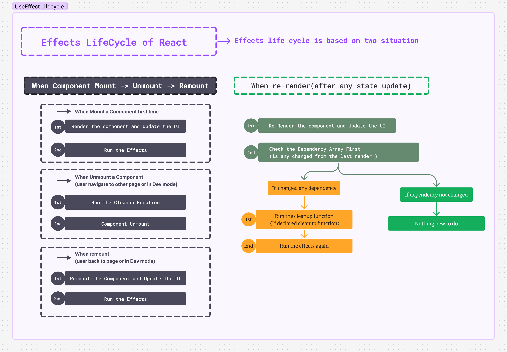

### রিয়াক্টের ইফেক্ট লাইফসাইকেল

রিয়াক্টের কম্পোনেন্টগুলো সাধারণত তিনটি স্টেজের মধ্যে দিয়ে যায়, যা আমরা লাইফসাইকেল বলে জানি:

1. **মাউন্ট:** যখন কম্পোনেন্ট প্রথমবার স্ক্রিনে আসবে এবং রেন্ডার হবে, তখন সেটি **মাউন্ট** হয়।
2. **আপডেট:** যখন প্রপ্স বা স্টেট পরিবর্তিত হয়, তখন কম্পোনেন্ট আবার রেন্ডার হয় এবং সেটি আপডেট হয়। 
3. **আনমাউন্ট:** যখন কম্পোনেন্ট স্ক্রিন থেকে চলে যায়, তখন **আনমাউন্ট** হয়। এটি তখন আর কোনো কাজ করে না বা রেন্ডার হয় না।

এভাবে কম্পোনেন্টগুলো লাইফসাইকেল সম্পন্ন করে। তবে, ইফেক্ট (যেমন `useEffect` হুক) এর ক্ষেত্রে একটু ভিন্ন ধারণা কাজ করে। ইফেক্ট কম্পোনেন্টের বাইরের কাজে, যেমন API বা সার্ভার-এর সাথে কাজ করার জন্য ব্যবহৃত হয়, এবং এটির নিজস্ব লাইফসাইকেল থাকে।

### ইফেক্টের কাজের বিশ্লেষণ

ধরি, আমরা একটি চ্যাটরুম অ্যাপ বানাচ্ছি, যেখানে আমরা এক্সটারনাল চ্যাট সার্ভারের সাথে কানেক্ট করতে চাই। এর জন্য আমরা **`useEffect`** হুক ব্যবহার করি। **`useEffect`** হুককে ব্যবহার করে, আমাদের চ্যাটরুমের কম্পোনেন্ট যখন প্রথমবার স্ক্রিনে আসবে, তখন সার্ভারের সাথে কানেকশন হবে। এবং যখন এই কম্পোনেন্ট স্ক্রিন থেকে চলে যাবে, তখন সেই কানেকশন বন্ধ হবে।

ধরা যাক, আমাদের চ্যাটরুমের কোডটা এমন:

```jsx
const serverUrl = "https://localhost:1234"; // আমাদের চ্যাট সার্ভারের URL

function ChatRoom({ roomId }) {
    useEffect(() => {
        // সার্ভারের সাথে কানেকশন করা
        const connection = createConnection(serverUrl, roomId);
        connection.connect(); // কানেকশন শুরু করা

        // যখন কম্পোনেন্ট স্ক্রিন থেকে যাবে, তখন কানেকশন বন্ধ করা
        return () => {
            connection.disconnect(); // কানেকশন বন্ধ করা
        };
    }, [roomId]); // roomId পরিবর্তিত হলে ইফেক্ট আবার চলবে
    // ...
}
```

এখানে, **`useEffect`** হুকটি সার্ভারের সাথে কানেকশন স্থাপন করে এবং যখন কম্পোনেন্ট স্ক্রিন থেকে চলে যায়, তখন সেই কানেকশন বন্ধ করে দেয়। আমরা যেহেতু **`roomId`** প্রপ্স হিসেবে পাচ্ছি, তাই এটি পরিবর্তিত হলে নতুন চ্যাটরুমে কানেকশন করতে হবে। 

### একাধিকবার সিঙ্ক্রোনাইজেশন কেন দরকার?

ধরা যাক, প্রথমে ইউজার **`General`** চ্যাটরুম সিলেক্ট করল। তখন প্রথমে কম্পোনেন্ট **`General`** রুমে কানেক্ট হবে এবং সেই রুমে চ্যাট শুরু করবে। 

এরপর যদি ইউজার **`Travel`** চ্যাটরুম সিলেক্ট করে, তাহলে **roomId** পরিবর্তিত হবে এবং **`useEffect`** হুক আবার রান করবে। এখন, প্রথমে **`General`** রুমের সাথে কানেকশন বন্ধ হয়ে, **`Travel`** রুমের সাথে কানেকশন স্থাপন করা হবে। এর জন্য ইফেক্টকে **re-synchronize** হতে হবে।

### রিয়াক্ট কিভাবে ইফেক্টকে সিঙ্ক্রোনাইজ করে?

রিয়াক্ট স্বয়ংক্রিয়ভাবে ইফেক্টগুলোকে সিঙ্ক্রোনাইজ করে। যখন কম্পোনেন্টের **স্টেট** বা **প্রপ্স** পরিবর্তিত হয়, তখন কম্পোনেন্ট নতুন করে রেন্ডার হয়। এর পরেই ইফেক্ট রান হয়। ইফেক্ট রান হওয়ার আগে, রিয়াক্ট চেক করে দেখবে যে **ডিপেন্ডেন্সি অ্যারে** (যেমন `[roomId]`) কোনো পরিবর্তন হয়েছে কিনা। যদি পরিবর্তন ঘটে, তবে রিয়াক্ট প্রথমে পূর্ববর্তী সিঙ্ক্রোনাইজেশন বন্ধ করে নতুন সিঙ্ক্রোনাইজেশন শুরু করে।

```jsx
const serverUrl = "https://localhost:1234";

function ChatRoom({ roomId }) {
    useEffect(() => {
        const connection = createConnection(serverUrl, roomId); // নতুন কানেকশন
        connection.connect(); // কানেকশন শুরু করা

        // কম্পোনেন্ট আনমাউন্ট হলে কানেকশন বন্ধ করা
        return () => {
            connection.disconnect();
        };
    }, [roomId]); // শুধুমাত্র যখন roomId পরিবর্তিত হবে, তখনই ইফেক্ট চলবে
}
```

এখানে, যখন **`roomId`** পরিবর্তিত হবে, তখন ইফেক্ট প্রথমে পুরনো কানেকশন বন্ধ করে নতুন কানেকশন শুরু করবে।

### রিয়াক্টের ইফেক্ট লাইফসাইকেলের চিত্র



### আলাদা আলাদা সিঙ্ক্রোনাইজেশন

ধরা যাক, আপনার অ্যাপের মধ্যে একাধিক ফিচার আছে, এবং প্রতিটি ফিচারের জন্য আলাদা আলাদা কাজ (যেমন কানেকশন, API কল, ইত্যাদি) করতে হবে। সেক্ষেত্রে, প্রতিটি কাজের জন্য আলাদা আলাদা **`useEffect`** হুক ব্যবহার করা উচিত, যাতে সেগুলো একে অপরকে বিঘ্নিত না করে। 

যেমন, যদি চ্যাটরুমের সাথে কানেকশন এবং লগইন সম্পর্কিত আলাদা আলাদা কাজ থাকে, তবে আমরা সেগুলোর জন্য আলাদা আলাদা ইফেক্ট হুক ব্যবহার করতে পারি।

### সিঙ্ক্রোনাইজেশন কোডের মূল পয়েন্ট

- **ইফেক্টের ডিপেন্ডেন্সি অ্যারে:** যখনই সেই অ্যারের কোনো ভ্যালু পরিবর্তিত হয়, তখন ইফেক্ট রান হবে।
- **ক্লিন-আপ ফাংশন:** পুরনো কানেকশন বা কার্যাবলী বন্ধ করার জন্য, আমরা ইফেক্টের শেষে একটি `return` ফাংশন ব্যবহার করি। এটি কম্পোনেন্ট আনমাউন্ট হওয়ার পর চলে।
- **re-Synchronization:** যখন কোনো প্রপ্স বা স্টেট পরিবর্তিত হয়, তখন ইফেক্ট আবার রান হয় এবং সিঙ্ক্রোনাইজেশন আপডেট হয়।

---
