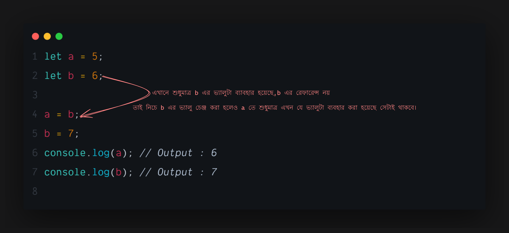

## <h1 className="bg-gradient-to-r from-blue-500 to-purple-500 inline-block text-transparent bg-clip-text text-5xl">Basic Javascript You Need to Know</h1>

---

## প্রিমিটিভ এর বাংলা অর্থ হলো `আদিম`।

জাভাস্ক্রিপ্টের জগতে বিভিন্ন ধরনের ডেটা টাইপ রয়েছে, যেগুলোকে আমরা প্রাথমিক বা আদিম ডেটা টাইপ হিসেবে চিহ্নিত করি। এখানে যেসব ডেটা টাইপ রয়েছে:

- **String**: এটি পাঠ্য ডেটা ধারণ করে।
- **Number**: এটি সংখ্যা সংরক্ষণ করে।
- **Boolean**: এটি সত্য (true) অথবা মিথ্যা (false) হতে পারে।
- **Null**: এটি একটি খালি বা অনুপস্থিত মান বোঝায়।
- **Undefined**: যখন কোন মান নির্ধারিত করা হয়নি।

এই প্রিমিটিভ ডেটাগুলো মূল ভ্যালু হিসেবে কাজ করে এবং এগুলোকে ব্যবহার করে অন্যান্য ডাটা তৈরি করা হয়। তাই এগুলোকে বলা হয় প্রিমিটিভ ডাটা বা ভ্যালু।

### উদাহরণ:

```javascript showLineNumbers
let name = "John"; // String
let age = 25; // Number
let isStudent = true; // Boolean
let notAssignedYet; // Undefined
let emptyValue = null; // Null
```

### References

জাভাস্ক্রিপ্টের মধ্যে `Array` এবং `Object` রয়েছে, যেগুলোকে বলা হয় রেফারেন্স টাইপ ডাটা। এই ডেটাগুলোর মধ্যে ডেটার ভ্যালু মেমোরির রেফারেন্স হিসেবে রাখা হয়।

### উদাহরণ:

```javascript showLineNumbers
let arr = [1, 2, 3]; // Array
let person = { name: "John", age: 25 }; // Object
```

---

## প্রিমিটিভ এবং রেফারেন্স টাইপ ডাটার পার্থক্য

প্রিমিটিভ এবং রেফারেন্স টাইপ ডাটার মধ্যে মূল পার্থক্য হলো এর ডেটার বিহেভিয়ার। আসুন নিচে উদাহরণের মাধ্যমে বিষয়টি আরও পরিষ্কার করি।

### প্রিমিটিভ টাইপ



```javascript showLineNumbers
let a = 5;
let b = a; // b এ a এর মান কপি হয়েছে
b = 10; // b এর নতুন মান 10

console.log(a); // Output: 5
console.log(b); // Output: 10
```

এখানে দেখা যাচ্ছে, প্রিমিটিভ ডাটা শুধুমাত্র ভ্যালুটি শেয়ার করে। ডাটার রেফারেন্স শেয়ার না করার কারণে `a` এর মান অপরিবর্তিত থাকে।

### রেফারেন্স টাইপ


```javascript showLineNumbers
let arr1 = [1, 2, 3]; // arr1 এ একটি অ্যারে সংরক্ষিত হয়েছে
let arr2 = arr1; // arr2 তে arr1 এর রেফারেন্স কপি করা হয়েছে

arr2.push(4); // arr2 তে নতুন মান 4 যোগ করা হয়েছে

console.log(arr1); // Output: [1, 2, 3, 4]
console.log(arr2); // Output: [1, 2, 3, 4]
```

এখানে দেখা যাচ্ছে, `arr2` তে নতুন মান যোগ করার পর `arr1` তেও সেই পরিবর্তন ঘটেছে, কারণ এখানে রেফারেন্স শেয়ার হয়েছে।


এভাবেই প্রিমিটিভ এবং রেফারেন্স ভ্যালুর মধ্যে মূল পার্থক্য প্রকাশ পায়।

---

## <h1 className="bg-gradient-to-r from-blue-500 to-purple-500 inline-block text-transparent bg-clip-text text-3xl py-2">Shallow Copy Vs Deep Copy</h1>

জাভাস্ক্রিপ্টে "শ্যালো কপি" (Shallow Copy) এবং "ডিপ কপি" (Deep Copy) হল দুটি আলাদা প্রক্রিয়া, যা ব্যবহার করে একটি `Object` বা `Array`'র কপি তৈরি করা হয়। তবে এদের মধ্যে মূল পার্থক্য হলো কিভাবে ডেটা কপি করা হয়।

### শ্যালো কপি (Shallow Copy)

শ্যালো কপিতে কেবলমাত্র অবজেক্টের প্রথম লেভেলের ভ্যালুগুলি কপি করা হয়। এর মানে হলো, যদি অবজেক্ট বা আরে'র মধ্যে নেস্টেড অবজেক্ট থাকে, তাহলে সেগুলি রেফারেন্স হিসেবে কপি হয়।

#### উদাহরণ:

```javascript showLineNumbers
let originalArray = [1, 2, { a: 3, b: 4 }]; // মূল অ্যারে

// শ্যালো কপি তৈরি করা
let shallowCopy = [...originalArray]; // নতুন অ্যারে তৈরি করা হয়েছে

console.log(shallowCopy); // [1, 2, { a: 3, b: 4 }]

// নেস্টেড অবজেক্ট পরিবর্তন করা
shallowCopy[2].a = 10; // shallowCopy তে পরিবর্তন হচ্ছে

console.log(originalArray); // [1, 2, { a: 10, b: 4 }]
console.log(shallowCopy); // [1, 2, { a: 10, b: 4 }]
```

এখানে দেখা যাচ্ছে, নেস্টেড অবজেক্টের রেফারেন্স কপি হওয়ার কারণে, কপি ডাটাতে পরিবর্তন করলে তা মূল ডাটাতেও প্রভাব ফেলে।

### ডিপ কপি (Deep Copy)

ডিপ কপিতে একটি অবজেক্টের প্রতিটি লেভেলের কপি তৈরি করা হয়, এমনকি নেস্টেড অবজেক্টেরও আলাদা কপি করা হয়।

#### উদাহরণ:

```javascript showLineNumbers
let originalArray = [1, 2, { a: 3, b: 4 }]; // মূল অ্যারে

// ডিপ কপি তৈরি করা (JSON পদ্ধতি ব্যবহার করে)
let deepCopy = JSON.parse(JSON.stringify(originalArray)); // নতুন অ্যারে তৈরি করা হয়েছে

deepCopy[2].a = 10; // deepCopy তে পরিবর্তন হচ্ছে

console.log(originalArray); // [1, 2, { a: 3, b: 4 }] // মূল অ্যারে অপরিবর্তিত
console.log(deepCopy); // [1, 2, { a: 10, b: 4 }] // কপি অ্যারে পরিবর্তিত
```

এখানে `deepCopy[2].a` পরিবর্তন করার পরেও `originalArray` অপরিবর্তিত থাকে, কারণ এটি একটি ডিপ কপি।

---

## <h1 className="bg-gradient-to-r from-blue-500 to-purple-500 inline-block text-transparent bg-clip-text text-3xl py-2">Advanced JavaScript</h1>

### `this` এর ব্যাবহার কোথায় এবং কিভাবে

`this` কি নির্দেশ করছে তা বুঝতে পারা খুবই গুরুত্বপূর্ণ, কারণ এটি কার্যকরী কোড লেখার ক্ষেত্রে অনেকটা প্রভাব ফেলে।

#### Implicit Binding

```javascript showLineNumbers
let player = {
  name: "Mashrafe",
  printPlayerName: function () {
    console.log(this.name); // এখানে this দিয়ে `player` অবজেক্টটাকে পয়েন্ট করা হয়েছে।
  },
};

player.printPlayerName(); // Output: Mashrafe
```

এখানে `this` নির্দেশ করছে `player` অবজেক্টকে, কারণ `printPlayerName` ফাংশনটি `player` অবজেক্টের মধ্যে কল করা হয়েছে। এটি সহজ এবং সাধারণ ব্যবহারের জন্য উপযুক্ত।

#### Explicit Binding - `.call()`

```javascript showLineNumbers
function printName() {
  console.log(this.name); // this এখন যে অবজেক্টে পয়েন্ট করবে সেটি নির্ভর করে call এর উপর।
}

let player = {
  name: "Sakib",
};

// call() এর মাধ্যমে this নির্দেশ করতে পারি
printName.call(player); // Output: Sakib
```

`.call()` মেথডটি ফাংশনকে নির্দিষ্ট একটি অবজেক্টের সাথে যুক্ত করতে ব্যবহৃত হয়। এখানে `printName` ফাংশনটিকে `player` অবজেক্টের সাথে যুক্ত করা হয়েছে, ফলে `this` এখন `player` কে নির্দেশ করছে।

#### `.apply()` এবং `.bind()`

```javascript showLineNumbers
function printPlayerDetails(virtue) {
  console.log(`${this.name} is ${virtue}`);
}

let player = { name: "Mashrafe" };

// apply() মেথড ব্যবহার করে
printPlayerDetails.apply(player, ["honest"]); // Output: Mashrafe is honest

// bind() মেথড ব্যবহার করে
let boundFunction = printPlayerDetails.bind(player, "captain");
boundFunction(); // Output: Mashrafe is captain
```

`.apply()` এবং `.bind()` মেথড দুটি ভিন্ন কাজ করে, যদিও এদের ব্যবহার একই।

- `.apply()` মেথডটি একটি ফাংশনকে একটি নির্দিষ্ট অবজেক্টের সাথে যুক্ত করার পাশাপাশি, একটি অ্যারে আকারে আর্গুমেন্টও গ্রহণ করে।
- `.bind()` মেথডটি একটি নতুন ফাংশন তৈরি করে, যেখানে `this` এবং আর্গুমেন্টগুলি পূর্বনির্ধারিত থাকে। এই নতুন ফাংশনটি পরে যেকোনো জায়গায় কল করা যেতে পারে।

---

## Iterators এবং Iterables

### `

Iterable` কী?

জাভাস্ক্রিপ্টের মধ্যে, `Iterable` হল এমন একটি অবজেক্ট যা একটি `Symbol.iterator` মেথড রয়েছে এবং এর মাধ্যমে এটি একটি iterator প্রদান করতে পারে। এটি ডেটাকে ধারাবাহিকভাবে প্রবাহিত করার একটি উপায়।

#### উদাহরণ:

```javascript showLineNumbers
const arr = [1, 2, 3];

for (const value of arr) {
  console.log(value); // Output: 1, 2, 3
}
```

এখানে `arr` একটি iterable, যার মাধ্যমে আমরা `for...of` লুপের সাহায্যে এর ভ্যালুগুলি একের পর এক পেতে পারি।

### `Iterator` কী?

`Iterator` হল এমন একটি অবজেক্ট যা `next()` মেথড সরবরাহ করে। এটি প্রতিটি কলের মাধ্যমে পরবর্তী মান এবং একটি `done` প্রপার্টি প্রদান করে, যা নির্দেশ করে যে আর কোন মান নেই কি না।

#### উদাহরণ:

```javascript showLineNumbers
const iterator = arr[Symbol.iterator]();

console.log(iterator.next()); // Output: { value: 1, done: false }
console.log(iterator.next()); // Output: { value: 2, done: false }
console.log(iterator.next()); // Output: { value: 3, done: false }
console.log(iterator.next()); // Output: { value: undefined, done: true }
```

এখানে `next()` মেথডের মাধ্যমে আমরা প্রতিটি মান এবং `done` স্টেটাস পাচ্ছি।

---

## <h1 className="bg-gradient-to-r from-blue-500 to-purple-500 inline-block text-transparent bg-clip-text text-3xl py-2">Asynchronous JavaScript</h1>

---

### পরিচিতি

জাভাস্ক্রিপ্ট একটি **সিঙ্গেল থ্রেডেড** প্রোগ্রামিং ল্যাঙ্গুয়েজ, যার মানে হলো এটি এক সময়ে একটি কাজই করতে পারে। তবে, এটি **অ্যাসিনক্রোনাস** (asynchronous) প্রোগ্রামিং সমর্থন করে, যা কিছু কাজকে একাধিক থ্রেডের মতো কার্যকরভাবে পরিচালনা করতে সক্ষম করে। এটি কার্যকরভাবে নেটওয়ার্ক অনুরোধ, টাইমআউট এবং অন্যান্য অপারেশন পরিচালনা করার জন্য ব্যবহার করা হয়, যা সাধারণত সময়সাপেক্ষ।

### সিঙ্গেল থ্রেডেড প্রোগ্রামিং

সিঙ্গেল থ্রেডেড হওয়ার কারণে, জাভাস্ক্রিপ্ট একটি কাজ সম্পন্ন না হওয়া পর্যন্ত পরবর্তী কাজ শুরু করতে পারে না। এটি একটি একক থ্রেডে চলে, যা প্রধান "মেইন থ্রেড" হিসাবে পরিচিত। উদাহরণস্বরূপ, যদি কোনও ফাংশন চলমান থাকে যা 5 সেকেন্ড সময় নেয়, তবে সেই সময়ে কোনও অন্যান্য কাজ সম্পন্ন হবে না।

#### উদাহরণ:

```javascript
console.log("Start");

for (let i = 0; i < 5; i++) {
  console.log(i);
}

console.log("End");
```

**আউটপুট:**

```
Start
0
1
2
3
4
End
```

### Callbacks

```javascript showLineNumbers
function fetchData(callback) {
  setTimeout(() => {
    const data = "Data fetched";
    callback(data);
  }, 1000);
}

fetchData((data) => {
  console.log(data); // Output: Data fetched
});
```

এখানে `setTimeout` ব্যবহার করে একটি `callback` ফাংশন কল করা হয়েছে।

### Promises

```javascript showLineNumbers
function fetchData() {
  return new Promise((resolve, reject) => {
    setTimeout(() => {
      const data = "Data fetched";
      resolve(data); // Promise সম্পন্ন হচ্ছে
    }, 1000);
  });
}

fetchData()
  .then((data) => {
    console.log(data); // Output: Data fetched
  })
  .catch((error) => {
    console.error(error);
  });
```

`Promise` একটি অবজেক্ট যা asynchronous অপারেশনের ফলাফল ধারণ করে। এটি `resolve` এবং `reject` এর মাধ্যমে সফলতা বা ব্যর্থতা নির্দেশ করে।

### Async/Await

```javascript showLineNumbers
async function fetchData() {
  return "Data fetched";
}

async function getData() {
  const data = await fetchData();
  console.log(data); // Output: Data fetched
}

getData();
```

#### ৩. Async/Await

`async/await` প্রমিসের উপর ভিত্তি করে, যা কোডকে আরও পাঠযোগ্য এবং পরিচালনাযোগ্য করে তোলে। `async` শব্দটি একটি ফাংশনের সামনে ব্যবহৃত হয়, এবং `await` শব্দটি প্রমিসের প্রতীক্ষা করার জন্য ব্যবহৃত হয়।

##### উদাহরণ:

```javascript
function delay(ms) {
  return new Promise((resolve) => setTimeout(resolve, ms));
}

async function asyncCall() {
  console.log("Calling...");
  await delay(2000); // 2 সেকেন্ডের জন্য অপেক্ষা
  console.log("Finished after 2 seconds");
}

asyncCall();
console.log("End");
```

**আউটপুট:**

```
Calling...
End
Finished after 2 seconds
```

### উপসংহার

জাভাস্ক্রিপ্টের অ্যাসিনক্রোনাস কার্যকলাপগুলি ব্যবহার করে, আমরা একাধিক কাজকে কার্যকরভাবে পরিচালনা করতে পারি, যেহেতু এটি সিঙ্গেল থ্রেডেড। কলব্যাক, প্রমিস, এবং `async/await` জাভাস্ক্রিপ্টে অ্যাসিনক্রোনাস কার্যকলাপের মূল সরঞ্জাম। এই প্রযুক্তিগুলি আমাদেরকে দ্রুত এবং কার্যকরভাবে কোড লেখার সুবিধা দেয়, বিশেষ করে নেটওয়ার্কের মাধ্যমে ডেটা আহরণ করার সময়।
