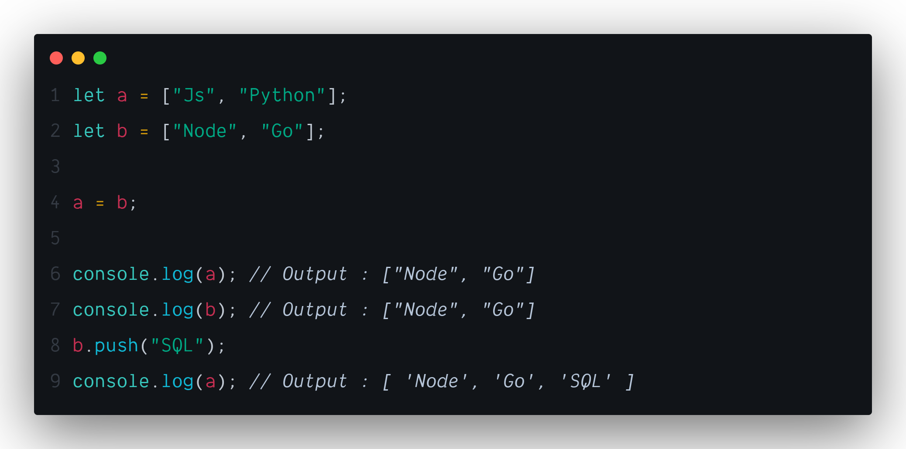
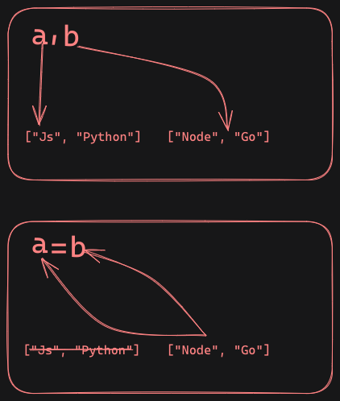

## <h1 className="bg-gradient-to-r from-blue-500 to-purple-500 inline-block text-transparent bg-clip-text text-5xl">Basic Javascript You Need to Know</h1>

---

## প্রিমিটিভ এর বাংলা অর্থ হলো `আদিম`। জাভাস্ক্রিপ্টে যেসব DATATYPE আছে যেমন

---

- String
- Number
- Boolean
- Null
- Undefined

এইগুলো হলো জাভাস্ক্রিপ্টের মূল বা একক। এগুলো ব্যাবহার করে অন্যান্য ডাটা বানানো হয়। এগুলোকে বলা হয় প্রিমিটিভ ডাটা বা ভ্যালু।

#### উদাহরণ:

```javascript showLineNumbers
let name = "John"; // String
let age = 25; // Number
let isStudent = true; // Boolean
let notAssignedYet; // Undefined
let emptyValue = null; // Null
```

### References

জাভাস্ক্রিপ্টের `Array` এবং `Object` কে বলা হয় রেফারেন্স টাইপ ডাটা বা ভ্যালু। এগুলোর মধ্যে ডেটার ভ্যালু মেমোরির রেফারেন্স হিসেবে রাখা হয়।

#### উদাহরণ:

```javascript showLineNumbers
let arr = [1, 2, 3]; // Array
let person = { name: "John", age: 25 }; // Object
```

---

## প্রিমিটিভ এবং রেফারেন্স টাইপ ডাটার পার্থক্যঃ

---

প্রিমিটিভ এবং রেফারেন্স টাইপ ডাটার মধ্যে মূল পার্থক্য হলো এর ডাটার বিহেভিয়ার নিয়ে। যেমন নিচে উদাহরণের মাধ্যমে বুঝানো হলোঃ

#### প্রিমিটিভ টাইপ


```javascript showLineNumbers
let a = 5;
let b = a;
b = 10;

console.log(a); // Output: 5
console.log(b); // Output: 10
```

প্রিমিটিভ ডাটা শুধুমাত্র ভ্যালুটা শেয়ার করে। ডাটার রেফারেন্স শেয়ার করেনা, যার ফলে `a` এর মান অপরিবর্তিত থাকে।

#### রেফারেন্স টাইপ



```javascript showLineNumbers
let arr1 = [1, 2, 3];
let arr2 = arr1;

arr2.push(4);

console.log(arr1); // Output: [1, 2, 3, 4]
console.log(arr2); // Output: [1, 2, 3, 4]
```

এখানে `a` কে যখন `b` দ্বারা রি-এসাইন করা হয়েছে তখন স্বাভাবিক ভাবেই `a` এর ভ্যালু চেঞ্জ হয়ে `b` এর যেই ভ্যালু ছিল তা হয়ে গিয়েছে। কিন্তু যখন `arr2` তে নতুন মান যোগ করা হলো, তখন `arr1` তেও সেই পরিবর্তন প্রভাবিত হয়েছে, কারণ এখানে রেফারেন্স শেয়ার হয়েছে।



এটাই হলো `primitives` আর `References` ভ্যালুর মধ্যে মূল পার্থক্য ।

---

## Shallow Copy Vs Deep Copy

---

জাভাস্ক্রিপ্টে "শ্যালো কপি" (Shallow Copy) এবং "ডিপ কপি" (Deep Copy) হল দুটি আলাদা প্রক্রিয়া যেগুলো ব্যবহার করে একটি `Object` বা `Array`'র কপি তৈরি করা হয়। তবে এদের মধ্যে বড় পার্থক্য হচ্ছে কিভাবে ডেটা কপি করা হয়।

### শ্যালো কপি (Shallow Copy)

---

শ্যালো কপিতে কেবলমাত্র অবজেক্টের প্রথম লেভেলের ভ্যালুগুলি কপি করা হয়। এর মানে হলো, যদি অবজেক্ট বা আরে'র মধ্যে নেস্টেড অবজেক্ট থাকে, তাহলে সেগুলি রেফারেন্স হিসেবে কপি হয়।

#### উদাহরণ:

```javascript showLineNumbers
let originalArray = [1, 2, { a: 3, b: 4 }];

// শ্যালো কপি তৈরি করা
let shallowCopy = [...originalArray];

console.log(shallowCopy); // [1, 2, { a: 3, b: 4 }]

// নেস্টেড অবজেক্ট পরিবর্তন করা
shallowCopy[2].a = 10;

console.log(originalArray); // [1, 2, { a: 10, b: 4 }]
console.log(shallowCopy); // [1, 2, { a: 10, b: 4 }]
```

নেস্টেড অবজেক্টের রেফারেন্স কপি হওয়ার কারণে কপি ডাটাতে পরিবর্তন করলে তা মূল ডাটাতেও প্রভাব ফেলে।

### ডিপ কপি (Deep Copy)

---

ডিপ কপিতে একটি অবজেক্টের প্রতিটি লেভেলের কপি তৈরি করা হয়, এমনকি নেস্টেড অবজেক্টেরও আলাদা কপি করা হয়।

#### উদাহরণ:

```javascript showLineNumbers
let originalArray = [1, 2, { a: 3, b: 4 }];

// ডিপ কপি তৈরি করা (JSON পদ্ধতি ব্যবহার করে)
let deepCopy = JSON.parse(JSON.stringify(originalArray));

deepCopy[2].a = 10;

console.log(originalArray); // [1, 2, { a: 3, b: 4 }]
console.log(deepCopy); // [1, 2, { a: 10, b: 4 }]
```

এখানে `deepCopy[2].a` পরিবর্তন করার পরেও `originalArray` অপরিবর্তিত থাকে, কারণ এটি একটি ডিপ কপি।

---

## Advanced JavaScript

---

### `this` এর ব্যাবহার কোথায় এবং কিভাবে

---

#### Implicit Binding

```javascript showLineNumbers
let player = {
  name: "Mashrafe",
  printPlayerName: function () {
    console.log(this.name); // এখানে this দিয়ে `player` অবজেক্টটাকে পয়েন্ট করা হয়েছে।
  },
};

player.printPlayerName(); // Output: Mashrafe
```

**👉 রুলস:** যেখানে ফাংশন কল করা হয়েছে, তার সামনে যদি কোনো অবজেক্ট থাকে, তবে সেই অবজেক্টকেই `this` পয়েন্ট করে।

#### Explicit Binding - `.call()`

```javascript showLineNumbers
function printName() {
  console.log(this.name);
}

let player = {
  name: "Sakib",
};

printName.call(player); // Output: Sakib
```

#### `.apply()` এবং `.bind()`

```javascript showLineNumbers
function printPlayerDetails(virtue) {
  console.log(`${this.name} is ${virtue}`);
}

let player = { name: "Mashrafe" };

// apply এর মাধ্যমে
printPlayerDetails.apply(player, ["honest"]); // Output: Mashrafe is honest

// bind এর মাধ্যমে
let boundFunction = printPlayerDetails.bind(player, "captain");
boundFunction(); // Output: Mashrafe is captain
```

---

## Iterators এবং Iterables

---

### `Iterables` কি?

```javascript showLineNumbers
let arr = [1, 2, 3];
for (let item of arr) {
  console.log(item); // Output: 1 2 3
}
```

Sorry about that! Here’s the same content formatted in MDX for you to copy and paste:

## Asynchronous JavaScript

---

### পরিচিতি

জাভাস্ক্রিপ্ট একটি **সিঙ্গেল থ্রেডেড** প্রোগ্রামিং ল্যাঙ্গুয়েজ, যার মানে হলো এটি এক সময়ে একটি কাজই করতে পারে। তবে, এটি **অ্যাসিনক্রোনাস** (asynchronous) প্রোগ্রামিং সমর্থন করে, যা কিছু কাজকে একাধিক থ্রেডের মতো কার্যকরভাবে পরিচালনা করতে সক্ষম করে। এটি কার্যকরভাবে নেটওয়ার্ক অনুরোধ, টাইমআউট এবং অন্যান্য অপারেশন পরিচালনা করার জন্য ব্যবহার করা হয়, যা সাধারণত সময়সাপেক্ষ।

### সিঙ্গেল থ্রেডেড প্রোগ্রামিং

সিঙ্গেল থ্রেডেড হওয়ার কারণে, জাভাস্ক্রিপ্ট একটি কাজ সম্পন্ন না হওয়া পর্যন্ত পরবর্তী কাজ শুরু করতে পারে না। এটি একটি একক থ্রেডে চলে, যা প্রধান "মেইন থ্রেড" হিসাবে পরিচিত। উদাহরণস্বরূপ, যদি কোনও ফাংশন চলমান থাকে যা 5 সেকেন্ড সময় নেয়, তবে সেই সময়ে কোনও অন্যান্য কাজ সম্পন্ন হবে না।

#### উদাহরণ:

```javascript
console.log("Start");

for (let i = 0; i < 5; i++) {
  console.log(i);
}

console.log("End");
```

**আউটপুট:**

```
Start
0
1
2
3
4
End
```

### অ্যাসিনক্রোনাস কার্যকলাপ

অ্যাসিনক্রোনাস কার্যকলাপের মাধ্যমে, আমরা কার্যক্রমগুলি সমান্তরালভাবে সম্পন্ন করতে পারি। এটি মূলত জাভাস্ক্রিপ্টের ইভেন্ট লুপ, কলব্যাক, প্রমিস, এবং `async/await` ব্যবহার করে অর্জিত হয়।

#### ১. কলব্যাক (Callback)

কলব্যাক একটি ফাংশন যা অন্য একটি ফাংশনের মধ্যে পাস করা হয় এবং ফাংশনটির কার্যক্রম শেষ হওয়ার পরে চালানো হয়।

##### উদাহরণ:

```javascript
console.log("Start");

setTimeout(() => {
  console.log("This is asynchronous");
}, 2000); // 2 সেকেন্ড পরে এটি কল হবে

console.log("End");
```

**আউটপুট:**

```
Start
End
This is asynchronous
```

এই উদাহরণে, `setTimeout` ফাংশন একটি কলব্যাক ফাংশন গ্রহণ করে যা 2 সেকেন্ড পরে কার্যকর হবে, তবে "Start" এবং "End" দ্রুত দেখানো হবে।

#### ২. প্রমিস (Promise)

প্রমিস হল একটি অবজেক্ট যা ভবিষ্যতে একটি মানের প্রতিনিধিত্ব করে। এটি সফলভাবে সম্পন্ন হলে বা যদি একটি ত্রুটি ঘটে, তখন এটি একটি অবস্থা গ্রহণ করে।

##### উদাহরণ:

```javascript
let promise = new Promise((resolve, reject) => {
  setTimeout(() => {
    resolve("Promise fulfilled");
  }, 2000);
});

promise.then((result) => {
  console.log(result); // 2 সেকেন্ড পরে "Promise fulfilled" দেখাবে
});

console.log("End");
```

**আউটপুট:**

```
End
Promise fulfilled
```

#### ৩. Async/Await

`async/await` প্রমিসের উপর ভিত্তি করে, যা কোডকে আরও পাঠযোগ্য এবং পরিচালনাযোগ্য করে তোলে। `async` শব্দটি একটি ফাংশনের সামনে ব্যবহৃত হয়, এবং `await` শব্দটি প্রমিসের প্রতীক্ষা করার জন্য ব্যবহৃত হয়।

##### উদাহরণ:

```javascript
function delay(ms) {
  return new Promise((resolve) => setTimeout(resolve, ms));
}

async function asyncCall() {
  console.log("Calling...");
  await delay(2000); // 2 সেকেন্ডের জন্য অপেক্ষা
  console.log("Finished after 2 seconds");
}

asyncCall();
console.log("End");
```

**আউটপুট:**

```
Calling...
End
Finished after 2 seconds
```

### উপসংহার

জাভাস্ক্রিপ্টের অ্যাসিনক্রোনাস কার্যকলাপগুলি ব্যবহার করে, আমরা একাধিক কাজকে কার্যকরভাবে পরিচালনা করতে পারি, যেহেতু এটি সিঙ্গেল থ্রেডেড। কলব্যাক, প্রমিস, এবং `async/await` জাভাস্ক্রিপ্টে অ্যাসিনক্রোনাস কার্যকলাপের মূল সরঞ্জাম। এই প্রযুক্তিগুলি আমাদেরকে দ্রুত এবং কার্যকরভাবে কোড লেখার সুবিধা দেয়, বিশেষ করে নেটওয়ার্কের মাধ্যমে ডেটা আহরণ করার সময়।

```


```
